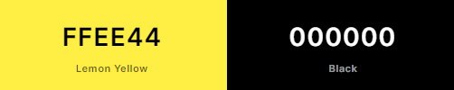
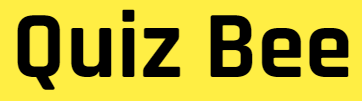
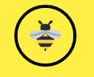
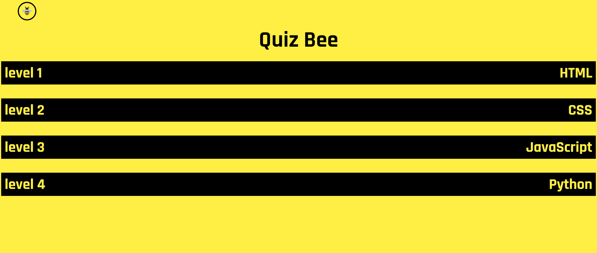
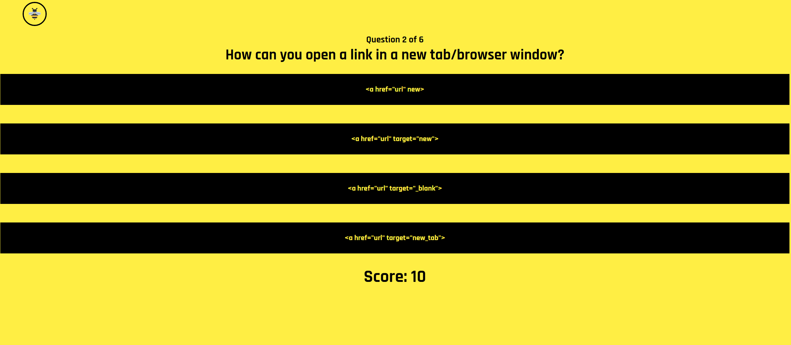
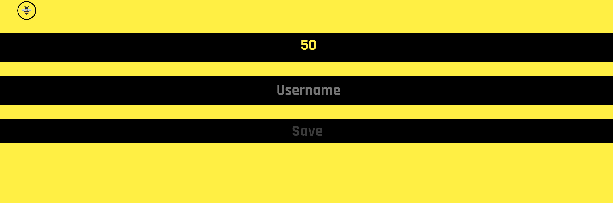
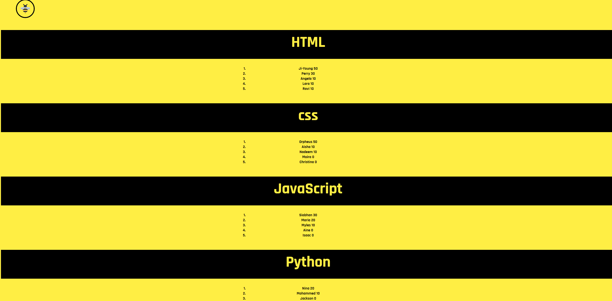

# Quiz Bee

This website has been created for users who want to test their knowledge on HTML, CSS, JavaScript and Python.

The live site can be viewed [here](https://jordanch05.github.io/javascript-quiz/index.html)

image of mockup of site

## Planning

* Colour Scheme

    * Simple bee themed colourscheme chosen
    * Contrasting black and yellow colours for easy legibility and style

* Font
    * Font taken from [Google Fonts](https://fonts.google.com/)
    * Rajdhani used for legibility
    * Good for small texts as it is without serifs
    * Q looks like a round bee with a stinger

* Figma
    * Pages were planned out on [Figma](https://www.figma.com) using wireframes

image of wireframes

## Features

* Logo
    * The logo was made using [Canva](canva.com)
    * Used as link to return to the home page
    * Logo uses same colour scheme as the rest of the site with an off yellow for the bee's body so it can still be seen

* Home Page

    * Has website title
    * Four buttons to choose which quiz to take

* Question and Answers

    * Question counter to tell you how many questions you are on and have left
    * Questions displayed at the top
    * Four multiple choice answer buttons which invert colours when hovered 
    * Updating score display to show how many correct answers have been chosen

* Final Score page

    * Final Score displayed at the end of the quiz
    * Username can be entered to save the final score and add to the highscores list

* Highscores page

    * Large headings for each highscore list that keep the bee theme
    * Top 5 highscores for each quiz

## Features left to implement

* Question counter bar

## Testing

### HTML

* Tested using the official [W3C Validator](https://validator.w3.org/nu/?doc=https%3A%2F%2Fjordanch05.github.io%2Fjavascript-quiz%2Findex.html)

### CSS

* Tested using the official [Jigsaw W3C Validator](https://jigsaw.w3.org/css-validator/validator?uri=https%3A%2F%2Fjordanch05.github.io%2Fjavascript-quiz%2Findex.html&profile=css3svg&usermedium=all&warning=1&vextwarning=&lang=en)

### JavaScript

* Tested using [Web Toolkit Online](https://webtoolkitonline.com/javascript-tester.html)

### Browsers

* Tested on Google Chrome and Microsoft Edge

### Accesssibility

* Tested using a web accessibility evaluation tool called [Wave](https://wave.webaim.org/)
* Semantic HTML is used
* Headers are in order and not skipped (h1, h2, h3)

## Deployment

* This site was deployed to GitHub pages. The steps to deploy are as follows:
    * In the GitHub repository, navigate to the Settings tab
    * From the source section drop-down menu, select the Master Branch
    * Once the master branch has been selected, the page will be automatically refreshed with a detailed ribbon display to indicate the successful deployment.

The link to the live site can be found [here](https://jordanch05.github.io/javascript-quiz/index.html)

## Credits

### Content

* The questions and answers were mainly taken from [W3Schools](https://www.w3schools.com/quiztest/default.asp)
* Python questions and answers were taken from [Real Python](https://realpython.com/quizzes/)
* A few questions were taken from [LinkedIn Skill Assesment Quizzes](https://www.linkedin.com/) 

### Media

* The logo was made using [Canva](canva.com)
* The font was taken from [Google Fonts](https://fonts.google.com/)

### Other

* [W3Schools](https://www.w3schools.com/) was used for reference
* The [Code Institute](https://codeinstitute.net/) study material was used
* Support from a [Code Institute](https://codeinstitute.net/) Tutor helped with a deployment issue